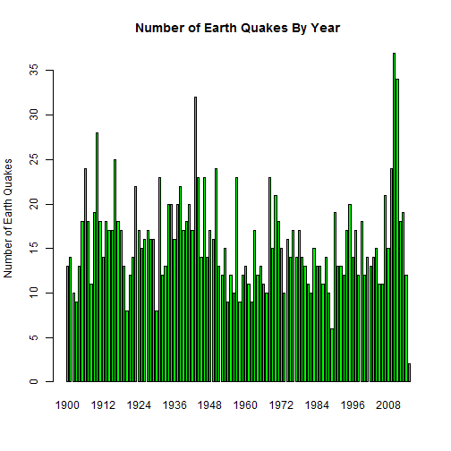

### Are Earth Quakes increasing in frequency?
It seems that daily we are hearing about a new earthquake or sometimes multiple earthquakes.  
While it is true that increasingly sensitive seismograph technology has increased the number of quakes 
detected this increased number of quakes are primarily in the low magnitude range below 2.5. This is too 
small to be felt by the average person. This also means that by limiting ourselves to major earth quakes, 
which have been easily detectable since the early 1900's, that we could analyze yearly data and look for 
patterns. This data would not be affected by increasingly sensitive detectors.  We have provided a Web App that 
allows web users to examine bar charts of this data selecting the magnitude below which the analysis would be cutoff 
and the year up to which the analysis would be run.  There are two primary measures calculated for the selected data. 

1. A count of the total number of earth quakes for the year.

2. The sum of the relative energy based on the cutoff magnitude of each earthquake.  

--- .class #id 

### Gathering Data 

The USGS web page provides a collection of data known as the Centennial collection that contains data between 1900 to 2007. THis can be downloaded from the usgs Web Site at <a link="http://earthquake.usgs.gov/data/centennial/centennial_Y2K.CAT"> USGS Centennial Catalog </a>. Unfortunately it stops at the year 2007.  Therefore we generated a query at the  <a link="http://earthquake.usgs.gov/earthquakes/search/">USGS ANSS Comprehensive Catalog </a>.  A simple query was made there for all data past the endpoint of the centennial catalog of magnitude greater than 6.0.  This was easily merged with the data from the centennial catalog to create a complete set of data ranging from 1900 to March 20, 2015.

The Relative Magnitude of energy calculation was calculated using the following formula.

$10^(1.5*(base - mag))$

This is based on the fact the the magnitude scales up by $10^1.5$ for each integral increase in magnitude.  Therefore the relative energy of say a 7.5 earthquake to that of a 5.0 earthquake should be $10^(1.5*2.5)$ since the difference between 5.0 and 7.5 is 2.5 units.  Since this is a relative energy level it is unitless and is only good for comparisons.  By summing this value for all earthquakes in a year we can get an idea of how much energy was released by earthquakes in that year relative to any other year.

--- .class #id

#### Number of EarthQuakes Greater than 7.0 for Years 1900 - 2015
 

In this plot it seems clear that there has been an increase in the number of earthquakes over the last 10 years starting around 2004.

--- .class id

#### Sum of Rel Mag Earth Quakes above 7.0 for Years 1900-2015
 

While the great alaska earth quake of 1964 is predominent it seems clear that there has been an increase in the last ten years of energy released by earthquakes.
